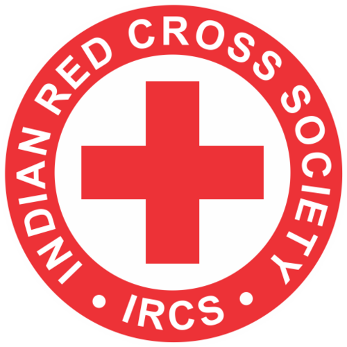

## Roadmap

- Definition and characteristics
- six functions of VHA
- Indian voluntary health agencies
- International and bilateral agencies
- Role in national health programmes and accountability


## Objectives

By the end of this session you should be able to:

- State definition of a voluntary health agency and its characteristics
- Explain the six functions of voluntary health agencies with examples
- List the major Indian voluntary health agencies and their focus
- Distinguish voluntary and bilateral agencies from inter-governmental ones


## Definition

::: {.callout-important}
> An organisation administered by an autonomous board, which holds meetings, collects funds chiefly from private sources, and expends money, whether with or without paid workers, in furthering public health by providing health services or health education, or by advancing research or legislation for health, or by a combination of these activities.
:::


## Characteristics 


- The United States had **over 20,000 voluntary health agencies by 1945**; such agencies flourished most in the USA.

. . .

:::: {.columns}
::: {.column width="50%"}
**Voluntary agencies = motor trucks**

Flexible; can take the by-ways.
:::
::: {.column width="50%"}
**Government agencies = railway trunk lines**

Must run on tracks laid down by law.
:::
::::

## Characteristics

- Administered by an **autonomous board**
- Funded **chiefly from private sources**
- May use **paid or volunteer** workers
- Registered under the Societies Act or as a Trust
- Foreign funding governed by the **FCRA**

## Voluntary vs government agency

| Feature | Voluntary agency | Government agency |
|:--|:--|:--|
| Mandate | Chosen by the board | Set by statute |
| Funding | Chiefly private | Public revenue |
| Flexibility | High; can pioneer | Bound by rules |
| Statutory basis | Registered society/trust | Law |

# Six functions of a VHA

## (a) Supplementing government work

- Government cannot meet the whole health need alone.
- Voluntary agencies add **personnel, funds, equipment, and services** to strengthen the public effort.

## (b) Pioneering

- Exploring new ways and means; once an approach succeeds, government can adopt it at scale.

::: {.callout-note}
**Example — family planning in India.** Voluntary agencies spearheaded the movement despite opposition, before government adopted it as national policy.
:::

## (c) Education

- Health education has **unlimited scope**.
- Government alone cannot cope with the demand without voluntary effort.

## (d) Demonstration

- Running demonstrations and experimental projects.

::: {.callout-note}
**Classic example — Rockefeller Foundation's bore-hole latrine** demonstration to control hookworm in India. Its modifications later became a standard part of India's environmental sanitation programme.
:::

## (e) Guarding government work

- By setting a good example, voluntary agencies can both **guide and critique** the work of government agencies.

## (f) Advancing health legislation

- Voluntary agencies **mobilise public opinion** and advance legislation on health matters for community benefit.

## The six functions at a glance {.smaller}

```{mermaid}
%%| fig-width: 11
%%| fig-height: 3.2
flowchart LR
  V[Voluntary<br/>health agency] --> A[a · Supplement]
  V --> B[b · Pioneer]
  V --> C[c · Educate]
  V --> D[d · Demonstrate]
  V --> E[e · Guard]
  V --> F[f · Legislate]
```


##  Indian Red Cross Society (1920) {.smaller}

:::: {.columns}
::: {.column width="70%"}
- Established by an **Act of the Indian Legislature, 1920**; over **400 branches**.
- Relief work in disasters and epidemics
- Milk and medical supplies to hospitals and MCH centres
- Armed forces welfare ("Red Cross Home", Bangalore)
- MCH welfare centres and family planning clinics
- Blood banks and first aid (St. John Ambulance)
- **Junior Red Cross** — youth wing for village uplift, first aid, anti-epidemic work
:::
::: {.column width="30%"}
{width="90%"}
:::
::::

## The International Red Cross Movement {.smaller}

- Founded by **Henry Dunant** after witnessing the Battle of **Solferino, 1859**.
- **First Geneva Convention, 1864** → International Committee of the Red Cross (ICRC).
- **League of Red Cross Societies, 1919** (Geneva) coordinates the national societies.

##  Hind Kusht Nivaran Sangh (1950) {.smaller}

- Headquarters in New Delhi; the precursor was the Indian branch of the **British Empire Leprosy Relief Association (BELRA)**.
- Financial help to leprosy homes and clinics
- Health education, training, and research
- Holds All-India Leprosy Workers' Conferences
- Publishes *Leprosy in India*

## Indian Council for Child Welfare (1952) {.smaller}

- Affiliated with the **International Union for Child Welfare**.
- Works through state and district councils.
- Secures children's right to healthy physical, mental, moral, spiritual, and social development.

## Tuberculosis Association of India (1939) {.smaller}

- Branches in all states; annual **TB Seal campaign** raises funds.
- Runs the New Delhi TB Centre, Lady Linlithgow Sanatorium (Kasauli), King Edward VII Sanatorium (Dharampur), and the TB Hospital (Mehrauli).

##  Bharat Sevak Samaj (1952) {.smaller}

- Non-political and non-official; branches in all states and most districts.
- Focus: improving **sanitation in villages**.

## Central Social Welfare Board (1953) {.smaller}

- Autonomous body under the Ministry of Education.
- Surveys the needs of voluntary welfare organisations
- Promotes and helps set up such organisations
- Gives financial aid to deserving organisations
- Started the **Family and Child Welfare Services (1968)** — craft teaching, literacy, maternity aid, balwadis

##  Kasturba Memorial Fund (1944) {.smaller}

- Created in memory of Kasturba Gandhi.
- Improves the lives of rural women through **gram-sevikas**.

##  Family Planning Association of India (1949) {.smaller}

- Headquarters in Mumbai; **pioneered** family planning work in India *(function b)*.
- Runs family planning clinics with government grants-in-aid.
- Trains doctors, health visitors, and social workers.

## All India Women's Conference (1926) {.smaller}

- At the time, the only nationwide women's voluntary welfare organisation.
- Runs MCH clinics, medical centres, adult education centres, milk centres, and family planning clinics.

##  All-India Blind Relief Society (1946) {.smaller}

- Coordinates institutions working for the blind.
- Organises **eye relief camps**.

##  Professional bodies {.smaller}

- Indian Medical Association
- All India Licentiates Association
- All India Dental Association
- Trained Nurses Association of India

::: {.callout-note appearance="simple"}
They hold conferences, publish journals, set professional standards, and organise relief camps in calamities.
:::

## Indian VHAs — summary {.smaller}

| Agency | Year | Focus |
|:--|:--:|:--|
| Indian Red Cross Society | 1920 | Relief, blood banks, MCH |
| All India Women's Conference | 1926 | Women's and child welfare |
| Tuberculosis Association of India | 1939 | Tuberculosis |
| Kasturba Memorial Fund | 1944 | Rural women |
| All-India Blind Relief Society | 1946 | Blindness |
| Family Planning Association of India | 1949 | Family planning |
| Hind Kusht Nivaran Sangh | 1950 | Leprosy |
| Indian Council for Child Welfare | 1952 | Child welfare |
| Bharat Sevak Samaj | 1952 | Village sanitation |
| Central Social Welfare Board | 1953 | Welfare coordination |

# International and bilateral agencies 

## Rockefeller Foundation (1913) {.smaller}

:::: {.columns}
::: {.column width="65%"}
- Chartered by John D. Rockefeller; India work began in **1920** with hookworm control in the Madras Presidency.
- Helped establish the **All India Institute of Hygiene and Public Health, Kolkata**.
- Trained teachers and researchers; supported rural training linked to teaching institutions.
:::
::: {.column width="35%"}
{width="100%"}
:::
::::

## Ford Foundation {.smaller}

:::: {.columns}
::: {.column width="65%"}
- Focus on **rural health services and family planning**, in contrast to Rockefeller's university and postgraduate focus.
- India projects: orientation training centres (Singur, Poonamalle, Najafgarh); NIHAE, Delhi; the Gandhigram rural health pilot (Tamil Nadu); the Calcutta water and drainage scheme.
:::
::: {.column width="35%"}
{width="100%"}
:::
::::

## CARE (1945) {.smaller}

:::: {.columns}
::: {.column width="65%"}
- Cooperative for Assistance and Relief Everywhere; founded after the Second World War in North America.
- India operations from **1950** — initially child feeding (ages 6–11).
- From the mid-1980s: ICDS support, anaemia control, and women's and reproductive health projects.
- Active across Andhra Pradesh, Bihar, Madhya Pradesh, Maharashtra, Odisha, Rajasthan, Uttar Pradesh, and West Bengal.
:::
::: {.column width="35%"}
{width="100%"}
:::
::::

## Colombo Plan (1950) {.smaller}

- Agreed at the Commonwealth Foreign Ministers' meeting, January 1950, for cooperative economic development in South and South-East Asia.
- 20 developing plus 6 non-regional members.
- AIIMS New Delhi received Colombo Plan support — fellowships and equipment (for example, cobalt therapy units).

## SIDA and DANIDA (bilateral) {.smaller}

:::: {.columns}
::: {.column width="65%"}
- **SIDA (Sweden)** — has assisted the National TB Control Programme since 1979 (X-ray units, microscopes, anti-TB drugs).
- **DANIDA (Denmark)** — has supported the National Blindness Control Programme since 1978.
:::
::: {.column width="35%"}
{width="100%"}
:::
::::

## Others

:::: {.columns}
::: {.column width="65%"}
- **Bill & Melinda Gates Foundation** — a major contemporary funder in global and Indian health.
- **VHAI (Voluntary Health Association of India)** — described in current sources as the apex coordinating body, a federation of 27 state associations.
:::
::: {.column width="35%"}
{width="100%"}
:::
::::

::: {.callout-note appearance="simple"}
Flagged separately from the textbook-examinable roster above.
:::

## Distinctions

::: {.panel-tabset}

### Voluntary / bilateral
Rockefeller, Ford, CARE, SIDA, DANIDA.

Funded chiefly from private or single-government sources.

### Inter-governmental
WHO, UNICEF, UNFPA, World Bank.

Funded and governed by member states — a **separate** chapter in Park's.

:::


## Role in national health programmes {.smaller}

- Family planning, tuberculosis, leprosy, and blindness control all drew direct historical contributions from voluntary and bilateral agencies.
- **Accountability:** FCRA compliance remains a live governance issue (for example, licence cancellations in 2024).

## Key takeaways

- Park's definition and the six functions (a–f) are core exam content.
- The Indian VHA roster carries specific founding years — high-yield SAQ material.
- Distinguish voluntary and bilateral agencies from inter-governmental ones.


## References

- Park K. *Park's Textbook of Preventive and Social Medicine.* (Voluntary health agencies; Ch. 25, international health agencies).
- Voluntary Health Association of India (VHAI). Supplementary current sources.

# Thank You
